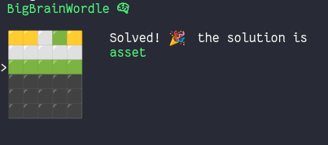

# BigBrainWordle

The assistant that help you cheat with wordle. Uses an entropy approach to determine the next word.

## Install

Check [Releases](https://github.com/kloki/bigbrainwordle/releases) for binaries and installers

or

```
cargo install bigbrainwordle --locked
```

## Run

Interactive mode — enter feedback manually to get suggestions:
```
bigbrainwordle
```

Autosolve against a specific word:
```
bigbrainwordle --autosolve crane
```

Autosolve today's NYT Wordle:
```
bigbrainwordle --nyt-today
```

Autosolve a past NYT Wordle by date:
```
bigbrainwordle --nyt-date 2025-01-15
```

## References

- [data_set](https://github.com/steve-kasica/wordle-words)
- [entropy approach](https://www.youtube.com/watch?v=v68zYyaEmEA)
